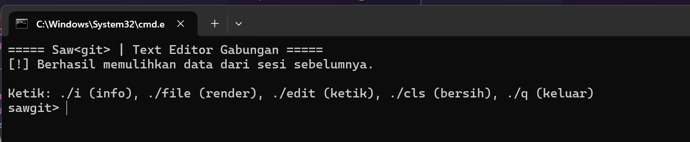
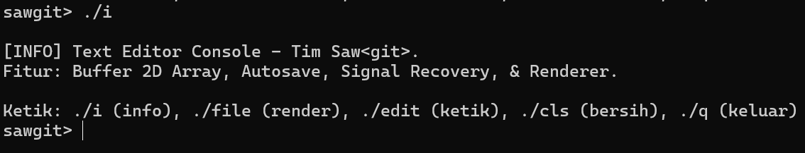
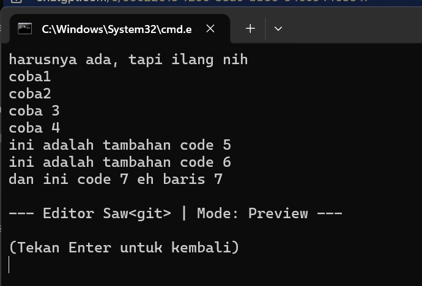
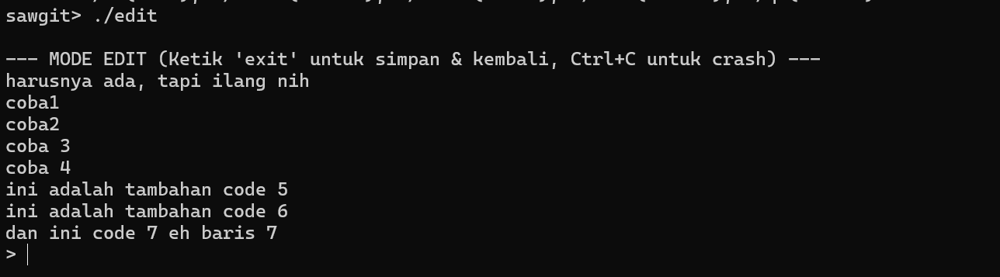
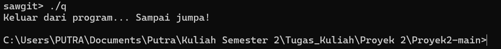

# Terminal Text Editor - Proyek 2

Terminal Text Editor adalah aplikasi penyunting teks sederhana berbasis terminal yang dibuat sebagai bagian dari tugas mata kuliah **Proyek 2**.

Program ini terinspirasi dari aplikasi **Notepad** pada sistem operasi Windows yang berfungsi untuk membuat, membuka, mengedit, dan menyimpan file teks tanpa format (plain text).

Implementasi program menggunakan **bahasa C** dengan representasi data menggunakan **struktur array 2 dimensi**.

---

# Overview

Text editor ini dirancang untuk memungkinkan pengguna melakukan manipulasi file teks langsung dari terminal.

Struktur data utama yang digunakan adalah **Array 2 Dimensi**:

- Baris → merepresentasikan **line teks**
- Kolom → merepresentasikan **karakter**

Akses karakter dilakukan menggunakan:

```
text[row][col]
```

Posisi kursor dikontrol menggunakan:

```
current_row
current_col
```

---

# Fitur

Fitur utama yang diimplementasikan dalam program ini:

- **Create File** – Membuat file teks baru  
- **Open File** – Membuka file teks yang sudah ada  
- **Update File** – Mengedit isi teks dalam file  
- **Save File** – Menyimpan isi array ke file  
- **Save As** – Menyimpan isi teks ke file baru  
- **Auto Recovery** – Menyimpan perubahan ke file sementara agar data tidak hilang  

---

# Setup Environment

Agar program dapat dijalankan, pastikan environment berikut tersedia:

- Sistem operasi **Windows / Linux / MacOS**
- **Terminal / Command Prompt**
- **GCC Compiler** untuk bahasa C
- **Git** untuk clone repository

Clone repository project:

```bash
git clone https://github.com/hmzahiqball/proyek2-texteditor.git
```

Masuk ke folder project:

```bash
cd proyek2-texteditor
```

Compile program:

```bash
gcc main.c -o texteditor
```

---

# Instalasi

Jika compiler belum tersedia, install terlebih dahulu.

### Linux

```bash
sudo apt install build-essential
```

### Windows

Gunakan salah satu:

- **MinGW**
- **WSL (Windows Subsystem for Linux)**

---

# Cara Pakai
## 1. Compile Program
Pastikan semua file .c ada di satu folder, lalu compile menggunakan cmd/powershell:
```bash
gcc *.c -o texteditor
```

## 2. Jalankan Program
Setelah program berhasil di-compile, jalankan program melalui terminal:

```bash
./texteditor
```

## 3. Preview Program
Contoh tampilan menu program:

```
===== Saw<git> | Text Editor Gabungan =====
Ketik: ./i (info), ./file (render), ./edit (ketik), ./cls (bersih), ./q (keluar)
sawgit>...
```
Jika ada data sebelumnya (autosave), akan muncul:

```
[!] Berhasil memulihkan data dari sesi sebelumnya.
```

Screenshot:
 

## Daftar Perintah
Di menu utama, tersedia beberapa command:
```
./i     -> Informasi program
./file  -> Menampilkan isi text (render)
./edit  -> Masuk mode edit
./cls   -> Membersihkan layar
./q     -> Keluar dari program
```

## Contoh penggunaan:
### 1. Perintah ./i (Info Program)
Menampilkan informasi tentang program:
```
[INFO] Text Editor Console - Tim Saw<git>.
Fitur: Buffer 2D Array, Autosave, Signal Recovery, & Renderer.
```
Screenshot:
 

### 2. Perintah ./file (Render Text)
Menampilkan isi text yang sudah disimpan:
```
(Tampilan isi text di layar)

--- Editor Saw<git> | Mode: Preview ---
(Tekan Enter untuk kembali)
```
Screenshot:
 

### 3. Perintah ./edit (Mode Edit File)
Masuk ke mode penulisan text:
```
--- MODE EDIT (Ketik 'exit' untuk simpan & kembali, Ctrl+C untuk crash) ---
```
Cara pakai:
- Ketik [text] → otomatis masuk ke buffer
- Setiap baris akan autosave
- Ketik exit → kembali ke menu utama

Autosave & Recovery:
- Setiap input di mode edit akan otomatis disimpan
- Jika program crash (Ctrl + C), data tetap aman
- Saat program dijalankan ulang → data akan direstore

Contoh saat crash:
```
[!] Program diinterupsi. Menyimpan recovery...
[!] Recovery tersimpan. Program keluar.
```

Screenshot:
 

### 4. Perintah ./cls (Clear Terminal)
Membersihkan tampilan terminal, dan kembali ke menu utama.

### 5. Perintah ./q (Exit Program)
Keluar dari program secara normal:
```
Keluar dari program... Sampai jumpa!
```
Screenshot:
 

---

# Identitas Tim

| NIM | Nama | ID Github | Manager |
|-----|-----|-----|-----|
| 251511056 | Putra Suyapratama | hmzahiqball | Pak Rizki |
| 251511057 | R. Neysa Rahma Velda | Neysavelda | Pak Rizki |
| 251511061 | Tania Dwi Pangesti | taniadwip | Pak Rizki |

---

# Repository

Github Team  
https://github.com/hmzahiqball/proyek2-texteditor